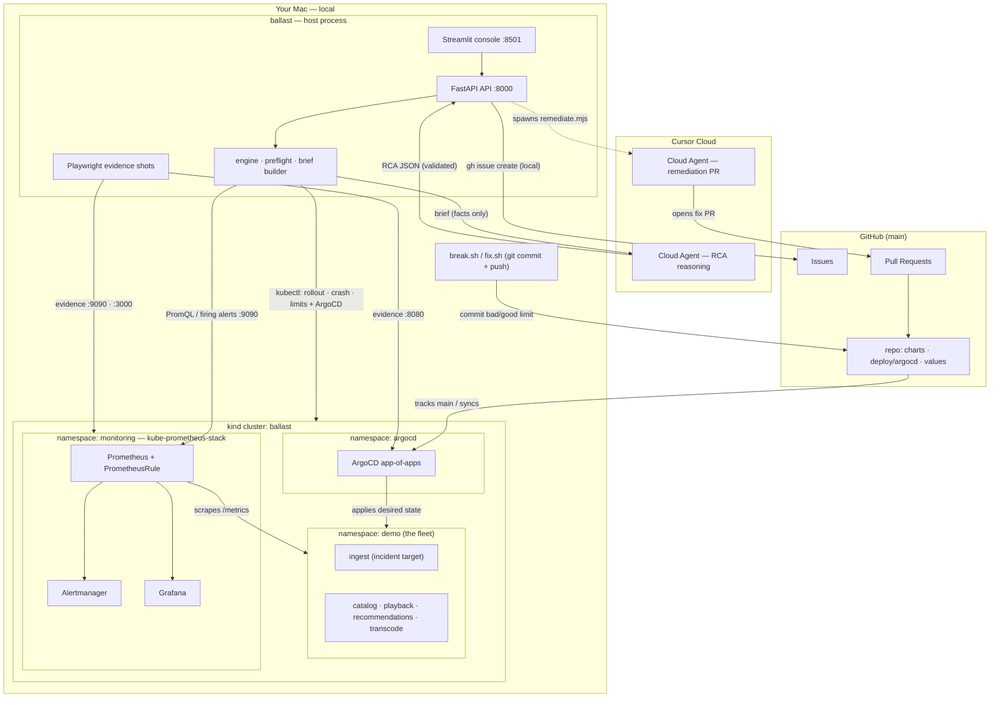

# cursor-k8s-ballast — solution architecture

A Cursor-driven **Root Cause Analysis** system for **GitOps / Kubernetes**
incidents on a media-streaming fleet. The incident class is a **bad Helm chart
bump** — a memory limit set too low — that drives the `ingest` service into
`OOMKill → CrashLoopBackOff`, investigated over Prometheus / Grafana / ArgoCD
and remediated back through GitOps.

## The core idea

The system is a loop with four moves, split deliberately across three trust
boundaries:

1. **GitOps deploy.** ArgoCD (app-of-apps in `deploy/argocd/`) syncs five
   interdependent services from git. State lives in the repo, not in `kubectl`.
2. **Local triage.** On a `CrashLoopBackOff`, `ballast/` runs cheap,
   deterministic triage against the *live cluster* on your Mac — Prometheus,
   Kubernetes, ArgoCD — and assembles a fact-only **investigation brief**.
3. **Cloud-agent RCA.** The brief is handed to a **Cursor Cloud Agent** that
   reasons over `brief + GitHub repo` and returns a strict, schema-validated
   **RCA**. A deterministic local engine is the fallback.
4. **GitOps remediation.** A GitHub issue is filed locally; a second Cloud Agent
   opens a **forward-fix PR**. Merging it lets ArgoCD sync the healthy value.

> **This is a hybrid system, not "100% cloud".** Everything that touches the
> cluster runs **locally on the Mac** (the kind cluster, `kubectl`, Prometheus
> on `:9090`, Grafana on `:3000`, ArgoCD on `:8080`, Playwright evidence shots).
> Only the **RCA reasoning** and the **remediation PR** run on Cursor Cloud, and
> a cloud agent **cannot** reach the Mac's localhost/kind — it works from the
> brief and the GitHub repo. See [Trust boundaries](#trust-boundaries).

## Architecture diagram



## Trust boundaries

| Boundary | Runs | Reaches |
|---|---|---|
| **Your Mac (local)** | kind cluster (`ballast`), ArgoCD, kube-prometheus-stack, and the `ballast` host process (API, console, engine, screenshots). | The live cluster directly (`kubectl`, `:9090`, `:3000`, `:8080`) and GitHub over the network. |
| **Cursor Cloud** | The RCA reasoning agent and the remediation-PR agent (`@cursor/sdk`). | The **GitHub repo** it clones (charts, `topology.yaml`, values, git history) and the **brief** it is handed. **Not** the Mac's localhost/kind. |
| **GitHub (`main`)** | The single source of truth: charts, ArgoCD manifests, per-service values. Issues and PRs. | ArgoCD pulls from it; break/fix and remediation push to it. |

Two `CURSOR_RUNTIME` modes select where the RCA agent runs
(`sdk-runner/run.mjs`, default `cloud`):

- **`cloud`** (default) — a dedicated Cursor VM clones the repo and reasons over
  `brief + repo`. Strong isolation; **cannot** see the Mac's live metrics.
- **`local`** (opt-in) — the agent runs on the Mac against the repo root so it
  *can* use the local Prometheus/Grafana MCP servers from `.cursor/mcp.json`.

The **remediation** agent (`sdk-runner/remediate.mjs`) is **always cloud** — it
edits the repo and opens a PR, which needs no cluster access.

## What runs where

| Stage | Runs on | Needs local cluster / localhost? |
|---|---|---|
| Preflight / triage (`ballast/preflight.py`, `ballast/sources.py`) | Your Mac (host process) | **Yes** — `kubectl`, Prometheus `:9090`, ArgoCD via `kubectl` |
| Brief assembly (`ballast/engine.py::assemble_brief`) | Your Mac | **Yes** — reads the triage sources |
| Evidence screenshots (`ballast/screenshot.py`, Playwright) | Your Mac | **Yes** — `:9090` / `:3000` / `:8080` |
| RCA reasoning (**default**, `task demo` → `BALLAST_INVESTIGATOR=cursor`) | **Cursor Cloud** agent | **No** — works from brief + GitHub repo; can't reach localhost |
| RCA fallback (`ballast/engine.py::analyze`, deterministic) | Your Mac | **Yes** — on-cluster analyzer, no LLM |
| GitHub issue (`ballast/remediate.py` via `gh`) | Your Mac | **No** cluster; needs `gh` auth + network |
| Remediation PR (`sdk-runner/remediate.mjs`, always cloud) | **Cursor Cloud** agent | **No** — edits repo, opens PR |
| Console `:8501` + API `:8000` | Your Mac | Console → API; API needs the cluster for live triage |

## Components

### The five services + the Helm chart

The fleet is five instances of one reusable chart, `charts/ballast-service`. Each
service is a small Python stub (`charts/ballast-service/files/app.py`, run on
`python:3.12-alpine`) that allocates a resident memory **ballast** at startup
and serves `/healthz`, `/readyz`, `/metrics` on `:8080`. Per-service values live
in `deploy/services/<name>.values.yaml`.

Declared dependency graph (`topology.yaml`) — `ingest` is the upstream incident
target; the rest depend on it (directly or transitively):

```
ingest ──▶ transcode ──▶ playback ──▶ recommendations
   └──────────────────────────────▶ catalog
```

**The `fullnameOverride` invariant.** `charts/ballast-service/values.yaml` sets
`fullnameOverride` (per service, in the values file) so the **Deployment name**,
the **pod label `app=<svc>`**, and the **container name** all equal the service
name (`charts/ballast-service/templates/_helpers.tpl`,
`.../templates/deployment.yaml`). The RCA correlation depends on this:

- `ballast/sources.py` selects pods and ReplicaSets with `-l app=<svc>`;
- kube-state-metrics series and the alert carry `container="<svc>"`;
- so the alert, the metrics, and the workload all line up on one identity.

Renaming would silently break the rollout↔alert correlation.

### ArgoCD app-of-apps + GitOps

`deploy/argocd/` is real GitOps:

- `root-app.yaml` — the single `Application` you bootstrap (`ballast-root`). It
  recurses `deploy/argocd/apps/` and owns everything else.
- `apps/<svc>.yaml` — one **multi-source** `Application` per service: the chart
  (`charts/ballast-service`) plus a `$values` ref to
  `deploy/services/<svc>.values.yaml`. Automated sync with `prune` + `selfHeal`.
- `project.yaml` — the `k8s-ballast` `AppProject` (destinations: `demo` fleet,
  `ballast` product namespace).

All Applications track `targetRevision: main`, so incident and fix commits must
land on `main` for ArgoCD to sync them. The rollout timestamp the engine
correlates against is the current ReplicaSet's `creationTimestamp` (read via
`kubectl`), which is the genuine result of an ArgoCD sync.

### kube-prometheus-stack + the alert

`clusters/monitoring-values.yaml` installs kube-prometheus-stack and sets the
`*SelectorNilUsesHelmValues=false` flags so the per-service `ServiceMonitor`s and
the alert rule are discovered without extra release labels.

`observability/prometheus-rule.yaml` defines the `ballast-crashloop`
`PrometheusRule` (in namespace `monitoring`) with the workflow's headline alert:

```yaml
- alert: StreamIngestCrashLooping
  expr: >-
    max by (namespace, container) (
      kube_pod_container_status_waiting_reason{
        namespace="demo", reason="CrashLoopBackOff"
      }
    ) > 0
  for: 1m
```

It fires **one minute** after any `demo`-namespace container enters
`CrashLoopBackOff`. A companion `StreamIngestOOMKilled` rule watches
`kube_pod_container_status_last_terminated_reason{reason="OOMKilled"}`. Because
`container == service name`, the alert points straight at `ingest`.

### The ballast engine pipeline

`brief-in / contract-out` is the spine of the whole system:

```
sources ──▶ brief ──▶ investigator ──▶ RCA contract ──▶ store/API ──▶ console
```

- **sources** (`ballast/sources.py`) — read-only `PrometheusSource` (HTTP API),
  `KubernetesSource` (`kubectl`: rollout time, crash state, live memory limit),
  and `ArgoCDSource` (`kubectl`: sync/health, revision, events). Each degrades
  rather than crashes; gaps are recorded in `brief.degraded`.
- **brief** (`ballast/engine.py::assemble_brief` → `ballast/brief.py`) — a typed
  `InvestigationBrief`: alert context, rollout context, ArgoCD context, blast
  radius hint (from `topology.yaml`), and the repo target. `to_agent_prompt()`
  renders the exact prompt a Cloud Agent receives.
- **investigator** (`ballast/investigator.py`) — one seam, three backends behind
  the contract:
  - `EngineInvestigator` → `engine.analyze` — deterministic multi-signal RCA
    (correlates Kubernetes crash + ArgoCD health + Prometheus alert against the
    rollout time). No LLM; the reliable default (`BALLAST_INVESTIGATOR=engine`).
  - `CursorInvestigator` — spawns `sdk-runner/run.mjs` as a **local node
    subprocess**, streams normalised events, and validates the returned RCA. This
    is the demo default (`task demo` sets `cursor`). If the cloud agent returns
    no valid RCA, `BALLAST_CURSOR_FALLBACK=1` falls back to the engine.
  - `MockInvestigator` — replays `fixtures/rca_ingest.json`.
- **RCA contract** (`ballast/contract.py`) — the trust boundary. Every RCA —
  engine, mock, or agent — is validated against the Pydantic `RCA` model before
  it is stored or rendered. Invalid agent output is rejected, never shown as a
  real finding.
- **orchestrator** (`ballast/orchestrator.py`) — drives triage → brief →
  screenshots → investigator, enriches the RCA with ArgoCD/Prometheus/Grafana
  evidence, persists to the in-memory `STORE` (`ballast/store.py`), and queues
  remediation when eligible. `ballast/preflight.py` gates all of this with a
  multi-signal readiness check (and idempotency, so one incident → one run).
- **API + console** (`ballast/api.py` `:8000`, `console/app.py` `:8501`) — the
  FastAPI service exposes the alert webhook, preflight, investigation, artifact,
  and RCA-chat endpoints; the Streamlit console (Verdict · Timeline · GitOps ·
  Agent feed) reads from it.

Read-only MCP tools (`ballast/mcp_server.py`) expose the same triage surface —
`get_firing_alerts`, `query_prometheus`, `rollout_status`, `blast_radius`,
`run_rca` — to a Cursor agent (alongside the official `mcp-grafana`).

### Incident mechanics (the intentional OOM)

The regression is deliberate and self-contained:

- The app allocates a **~40 MiB** resident working set (`ballastMb: 40` in
  `deploy/services/ingest.values.yaml`, touched so it is resident).
- Healthy `resources.limits.memory` is **`128Mi`** — comfortably above it.
- `scripts/break.sh` lowers that one field to **`16Mi`** (via `awk`, preserving
  the rest), commits, and opens a PR on `main`. On merge, ArgoCD syncs it, the
  kubelet OOM-kills `ingest` on startup (exit **137**) → `CrashLoopBackOff` →
  `StreamIngestCrashLooping` after `for: 1m`.

So the OOM is the demo's regression, not a broken environment. `scripts/fix.sh`
reverses it (restore `128Mi`) the same way.

> The **live in-cluster** crash reproduces on a normal Docker/Kubernetes host
> (the Mac). The Cursor Cloud VM cannot run a nested cluster (see `AGENTS.md`);
> `task rca:offline` / `task rca:mock` exercise the engine there instead.

### Remediation (hybrid)

`ballast/remediate.py` runs when the RCA recommends `forward_fix`/`rollback` and
auto-remediate is on:

1. **GitHub issue — local.** Filed via the `gh` CLI on the Mac
   (`gh issue create`), formatted from the RCA.
2. **Fix PR — cloud.** `sdk-runner/remediate.mjs` launches a Cursor Cloud Agent
   (`autoCreatePR: true`) that restores `resources.limits.memory` in
   `deploy/services/<svc>.values.yaml` and opens a PR linking the issue. It does
   **not** merge.
3. **Merge → sync.** A human merges to `main`; ArgoCD syncs the healthy value.
   Background watchers reconcile the PR URL and stamp the merge time.

### What changes cluster state (and what never does)

- **State changes come only from git:** `break.sh` / `fix.sh` commits, and the
  remediation PR. ArgoCD reconciles the cluster from `main`.
- **The RCA engine and all triage are strictly read-only** — Prometheus/Grafana
  MCP is read-only, `KubernetesSource`/`ArgoCDSource` only `kubectl get`, and the
  engine never mutates the cluster.

## The RCA JSON contract

`ballast/contract.py` (Pydantic v2) defines the `RCA` model:
`summary`, `confidence`, `timeline`, `rollout_correlation`, `resource_change`,
`evidence`, `supporting_telemetry`, `blast_radius`, and `recommended_action`.
`schema/rca.schema.json` is the JSON Schema generated from it
(`python -m ballast.contract`) and is embedded verbatim into the agent prompt —
so the Cloud Agent is handed an exact target and its output fails closed on any
deviation.

## Design seams (prototype vs production)

The system keeps a few deliberate seams so the demo is honest about what would
change in production — the *reasoning* is identical, only the data source moves:

1. **Topology.** `topology.yaml` is a declared graph today; a service-mesh /
   Consul MCP `TopologySource` would supply the live graph in production. Blast
   radius carries its provenance in `graph_source`.
2. **Rollout timestamp.** The current ReplicaSet `creationTimestamp` here; ArgoCD
   sync history in production. The correlation logic is unchanged.
3. **Metrics access.** The Prometheus HTTP API on a port-forward here; a
   read-only Grafana/Prometheus MCP with a Viewer token in production
   (`mcp-grafana`, `.mcp.json`).
4. **Investigator.** `engine` / `mock` / `cursor` behind the RCA contract — the
   contract is the trust boundary regardless of which produces the answer.
